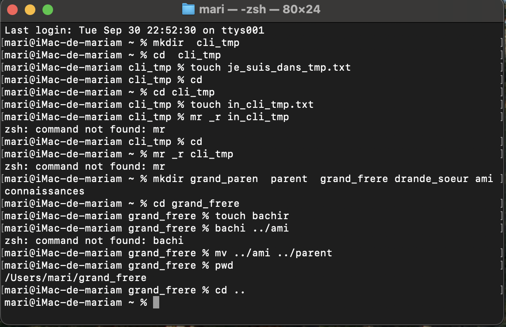

explications de mes commande utilises mkdir conteneur : je l’utilise pour créer un dossier appelé conteneur dans mon répertoire personnel.

cd conteneur : je l’utilise pour entrer dans le dossier conteneur.

mkdir voitures ustensiles electronique : je l’utilise pour créer trois sous-dossiers appelés voitures, ustensiles et electronique.

cd voitures : je l’utilise pour entrer dans le dossier voitures.

echo "benz" >> mes_voitures.txt : je l’utilise pour ajouter le mot benz dans un fichier appelé mes_voitures.txt.

echo "toyota" >> mes_voitures.txt : je l’utilise pour ajouter le mot toyota dans ce fichier.

echo "honda" >> mes_voitures.txt : je l’utilise pour ajouter le mot honda dans ce fichier.

cd ../ustensiles : je l’utilise pour entrer dans le dossier ustensiles.

echo "cuillere" >> cuisine.txt : je l’utilise pour ajouter le mot cuillere dans un fichier appelé cuisine.txt.

echo "marmite" >> cuisine.txt : je l’utilise pour ajouter le mot marmite dans ce fichier.

echo "couteau" >> cuisine.txt : je l’utilise pour ajouter le mot couteau dans ce fichier.

cat cuisine.txt : je l’utilise pour vérifier le contenu du fichier cuisine.txt.

cd .. : je l’utilise pour revenir dans le dossier conteneur.

ls : je l’utilise pour lister le contenu du dossier conteneur et voir les sous-dossiers (voitures, ustensiles, electronique).

