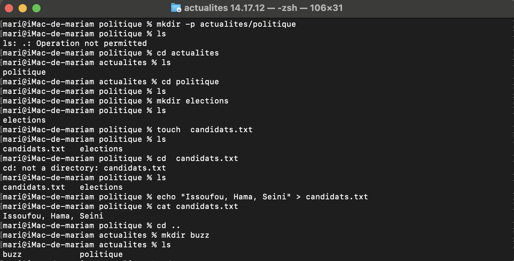

 
 explication de mes comùandes d'excutions 
 
 
mkdir -p actualites/politique/elections : je l’utilise pour créer en une seule commande l’arborescence complète actualites/politique/elections.

cd actualites/politique/elections : je l’utilise pour entrer dans le dossier elections.

echo "Issoufou" >> candidats.txt : je l’utilise pour écrire Issoufou dans le fichier candidats.txt.

echo "Hama" >> candidats.txt : je l’utilise pour ajouter Hama dans le fichier.

echo "Seini" >> candidats.txt : je l’utilise pour ajouter Seini dans le fichier.

cd ../.. : je l’utilise pour remonter de deux niveaux et revenir dans le dossier actualites.               

mkdir buzz : je l’utilise pour créer un nouveau dossier appelé buzz dans actualites.

<<<<<<< HEAD

=======

>>>>>>> 82e2331 (nu!hn!)
