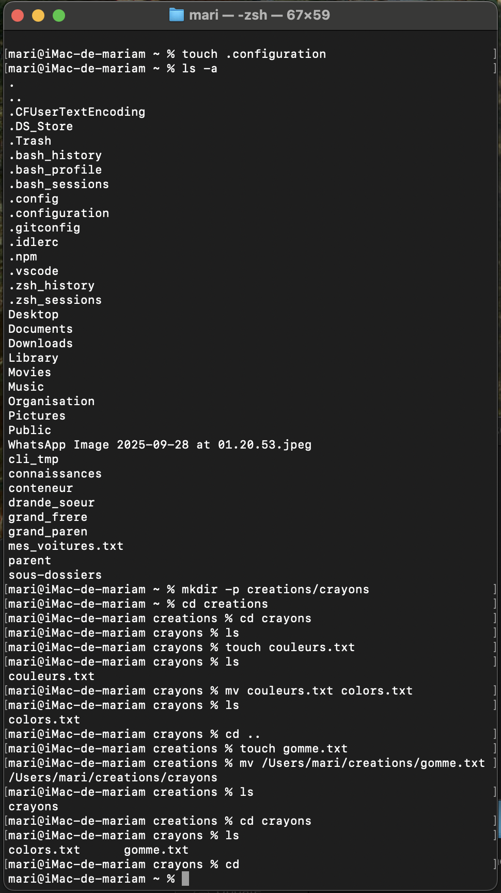

explications de mes command utilise 
 
 
 
touch ~/.configuration : je l’utilise pour créer un fichier caché appelé .configuration dans mon répertoire personnel (~).

ls -a ~ : je l’utilise pour vérifier la présence du fichier .configuration (avec -a j’affiche aussi les fichiers cachés).

mkdir -p creations/crayons : je l’utilise pour créer en une seule commande l’arborescence creations/crayons.

cd creations/crayons : je l’utilise pour entrer dans le dossier crayons.

touch couleurs.txt : je l’utilise pour créer un fichier vide appelé couleurs.txt.

mv couleurs.txt colors.txt : je l’utilise pour renommer le fichier couleurs.txt en colors.txt.

cd .. : je l’utilise pour revenir dans le dossier creations.

touch gomme.txt : je l’utilise pour créer un fichier vide appelé gomme.txt.

mv gomme.txt crayons/ : je l’utilise pour déplacer le fichier gomme.txt dans le dossier crayons.

