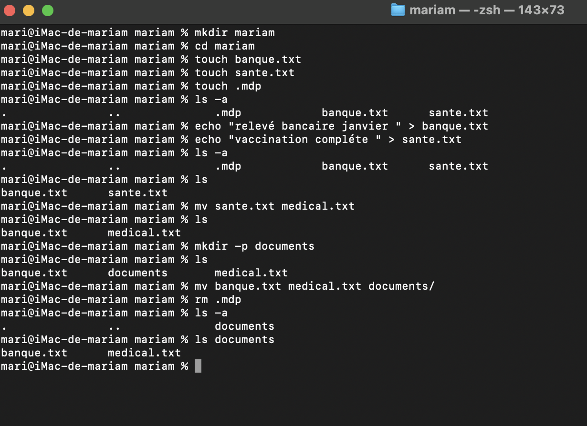

 
 explication de mes commande utilise
 
 
 
mkdir mariam && cd mariam : je l’utilise pour créer un dossier personnel portant mon nom (mariam) et entrer dedans directement.

touch banque.txt sante.txt .mdp : je l’utilise pour créer trois fichiers :

banque.txt

sante.txt

et un fichier caché .mdp.

echo "Relevé bancaire janvier" > banque.txt : je l’utilise pour écrire Relevé bancaire janvier dans le fichier banque.txt.

echo "Vaccination complète" > sante.txt : je l’utilise pour écrire Vaccination complète dans le fichier sante.txt.

ls -a : je l’utilise pour vérifier la présence du fichier caché .mdp (car -a permet d’afficher aussi les fichiers cachés).

mv sante.txt medical.txt : je l’utilise pour renommer le fichier sante.txt en medical.txt.

mkdir documents : je l’utilise pour créer un dossier appelé documents.

mv banque.txt medical.txt documents/ : je l’utilise pour déplacer les fichiers banque.txt et medical.txt dans le dossier documents.

rm .mdp : je l’utilise pour supprimer uniquement le fichier caché .mdp.

<<<<<<< HEAD

=======

>>>>>>> 82e2331 (nu!hn!)
